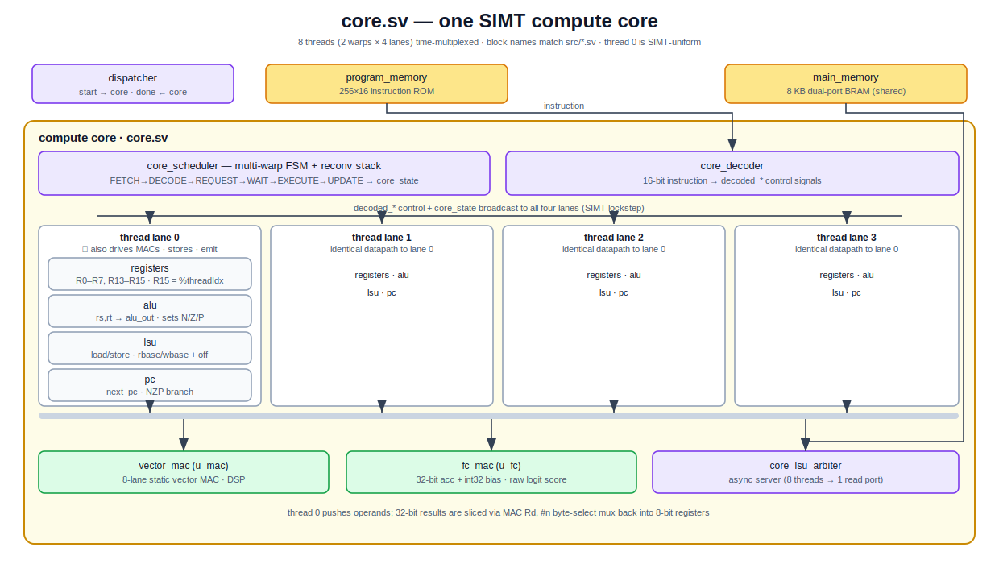
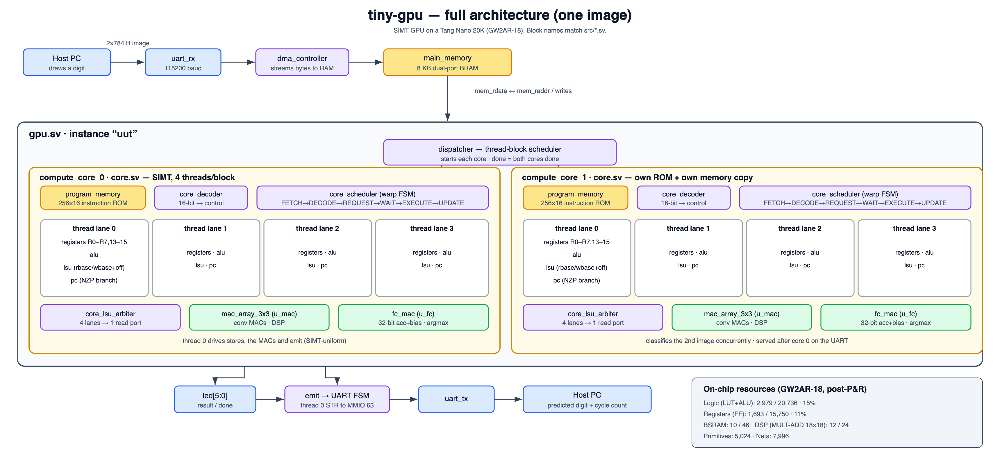
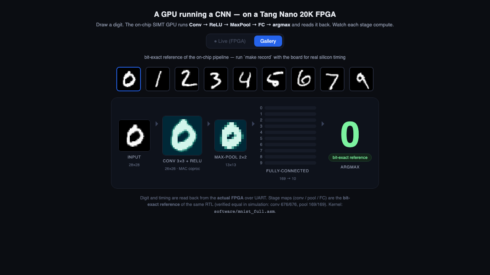
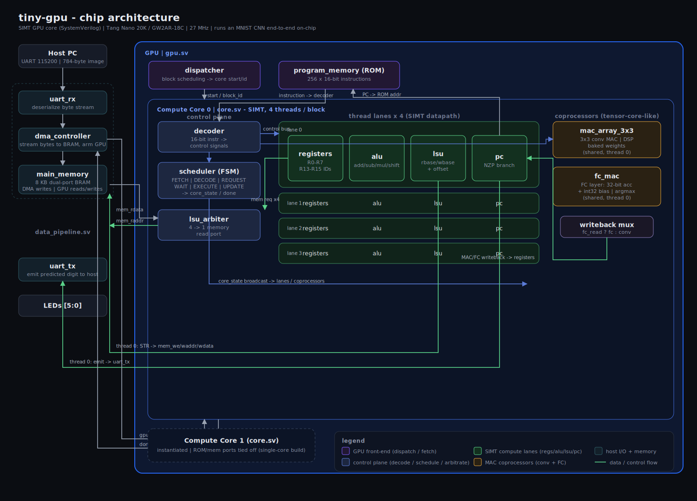

# tiny-gpu on the Tang Nano 20K — a GPU running a CNN

A minimal **SIMT GPU core** in SystemVerilog (with a Rust assembler) synthesized to a **Sipeed Tang Nano 20K** (Gowin GW2AR-18C) that runs a **real trained convolutional neural network end-to-end on-chip**. You stream a 28×28 MNIST image to the board over UART; the GPU runs the whole pipeline — **convolution → ReLU/quantize → max-pool → fully-connected → argmax** — and sends back the predicted digit. No host-side compute.

The GPU is a genuine little SIMT machine (4-thread warps, scheduler, dispatcher, register file, ALU, load/store unit), and the heavy matrix math runs in MAC coprocessors the GPU drives — the same division of labor as tensor cores on a real GPU. It is deliberately _tiny_ (8-bit datapath, single 3×3 conv filter, 256-instruction ROM); accuracy on the bundled 50-image test set is ~94%. But it is, honestly, a GPU executing an AI model.

## Architecture

**One SIMT core (`core.sv`).** A warp scheduler and decoder drive four thread lanes in lockstep; each lane has its own registers, ALU, LSU, and PC. The four lanes share an LSU arbiter (1 memory port) and two MAC coprocessors — `mac_array_3x3` (conv) and `fc_mac` (FC + argmax) — that thread 0 feeds SIMT-uniformly.



**The whole chip.** Two of those cores sit under a dispatcher, fed by the host UART → DMA → memory chain, with the result emitted back over UART. Every block name matches a module in `src/*.sv`.



## Status

- ✅ **Full MNIST CNN runs on the FPGA.** Five images streamed back-to-back (no reflash) classify correctly: `7, 2, 0, 9, 9`.
- ✅ **Bit-exact to a Python reference** in simulation: conv map 676/676, pooled 169/169, end-to-end predictions match `software/mnist_ref.py` on every image tested.
- ✅ Closes timing at the native **27 MHz** clock (0 setup / 0 hold violations).

## Demo — draw a digit, watch the GPU read it



A browser canvas streams your digit to the board; the page then animates every stage of the on-chip pipeline — **input 28×28 → conv 26×26 → max-pool 13×13 → FC logits → argmax** — and shows the predicted digit with the real on-chip run time.

```sh
make demo            # serves http://localhost:8000
```

Two ways to run it:

- **Live (board attached).** With the Tang Nano plugged in, the page auto-enables _Live_ mode: draw → the image is streamed over UART, the FPGA classifies it, and the **digit + cycle-accurate timing come straight from silicon**.
- **Gallery (no hardware).** With no board (or when opened as a static page — it's hostable on GitHub Pages), the page falls back to _Gallery_ mode and replays captured runs from `demo/recordings/`. Capture your own:

  ```sh
  make record                       # canonical 0–9 spread, real on-chip timing (needs the board)
  python3 demo/record.py --offline  # stages only, no board (reference digit, no timing)
  ```

> **What's real vs. reference:** the **digit and timing are read back from the actual FPGA**. The conv/pool/FC stage _images_ are rendered from `mnist_ref.py`, the bit-exact software model of the same RTL (verified equal in simulation: conv 676/676, pool 169/169) — so they show exactly what the chip computed, without a firmware change to dump the intermediate BRAMs.

### Recording a GIF/clip

To capture the looping GIF for this section, screen-record the live page on the real board and convert (macOS):

```sh
# record the browser window with QuickTime / ⇧⌘5, save out.mov, then:
ffmpeg -i out.mov -vf "fps=18,scale=900:-1:flags=lanczos" -loop 0 docs/demo.gif
#   or, sharper/smaller:  brew install gifski && gifski --fps 18 --width 900 -o docs/demo.gif frames/*.png
```

Then swap `docs/demo.png` above for `docs/demo.gif`.

## How it works

```
   PC ──UART(115200)──▶ DMA ──▶ image @ addr 0      (784 bytes)
                                     │
                 ┌───────────────────┴─────────────────────────────┐
                 │  GPU runs software/mnist_full.asm  (one kernel)  │
                 │   Conv 3×3  (MAC coprocessor, baked weights)     │
                 │     → ReLU + >>8 quantize  → conv map (BRAM)      │
                 │   MaxPool 2×2  (MAX pseudo-op)  → pooled (BRAM)   │
                 │   Scatter pooled features into the FC buffer     │
                 │   FC 169→10  (FC-MAC: 32-bit acc + int32 bias)   │
                 │     → argmax  → predicted digit                  │
                 └───────────────────┬─────────────────────────────┘
                                     ▼
   PC ◀──UART──  predicted digit (1 byte)
```

All weights/biases are **baked into the bitstream** (trained model from the companion `cnn_chip` project): conv weights into the MAC coprocessor, FC weights into a BRAM buffer, biases into the FC-MAC ROM. The host sends only the image.

The full datapath (GPU core + coprocessors + memory/DMA + UART) is laid out in [`docs/architecture.md`](docs/architecture.md):



### Data-memory map (8 KB BRAM, `ADDR_BITS=13`)

| range | contents | written by |
| --- | --- | --- |
| `0 .. 783` | 28×28 input image | DMA (host) |
| `1024..1699` | 26×26 conv feature map | GPU (`STR`) |
| `1700..1868` | 13×13 pooled map | GPU (`STR`) |
| `2048..5427` | FC buffer: `[feature, weight]×1690` | weights baked; features scattered by GPU |
| `[63]` | memory-mapped UART TX (emit) | GPU (`STR 63`) |

The LSU has **two base pointers** so a stage can read one region and write another: `rbase` (advanced by `ADDB`) for loads, `wbase` (advanced by `WBASE`) for stores.

## Instruction set (16-bit)

`[15:12]` opcode · `[11:9]` rd · `[8:6]` rs · `[5:0]` imm (register rt in `[2:0]`).

| opcode | mnemonic | meaning |
| --- | --- | --- |
| `0000` | `FRST`/`FMAC`/`FARG`/`FBEST` | FC-MAC coprocessor (sub-fn in `[5:4]`): reset / `acc+=rs*rt` / finalize digit (add int32 bias, argmax) / read predicted digit |
| `0001` | `ADD rd,rs,rt` | rd = rs + rt |
| `0010` | `MOV rd,#imm` | rd = imm (6-bit) |
| `0010` | `TID`/`BID`/`BDIM rd` | `MOV` with `rs`≠0: rd = threadIdx (R15) / blockIdx (R13) / blockDim (R14) |
| `0011` | `CMP rs,rt` | set N/Z/P flags |
| `0100` | `LDR rd,[rs]` | rd = mem[rbase + rs] |
| `0101` | `ADDI rd,rs,#imm` | rd = rs + imm |
| `0110` | `MACL rs` | push a pixel into the 3×3 MAC buffer |
| `0111` | `MAC rd` | fire the 3×3 MAC (baked weights) → rd |
| `1000` | `BRn target` | branch if N (8-bit target, reaches whole ROM) |
| `1001` | `ADDB #imm` / `WBASE #imm` | advance read base / write base (`[11]` selects) |
| `1010` | `MUL rd,rs,rt` | rd = rs · rt |
| `1011` | `STR rt,[rs]` | mem[wbase + rs] = rt (rs==63 → UART TX) |
| `1100`/`1101`/`1110` | `SHR`/`SHL`/`SUB` | shifts / subtract |
| `1111` | `RET` | halt thread |
| _(pseudo)_ | `MAX rd,ra,rb` | assembler-expanded (`CMP`+`BRn`+`ADDI`) |

Only **R0–R7** are instruction-addressable (3-bit fields); R13–R15 are SIMT identity regs, readable via `TID`/`BID`/`BDIM` (which copy them into an R0–R7 register). With `TID`, the 4 lanes finally diverge — e.g. `TID R1` then `LDR R2,[R1]` loads `mem[threadIdx]` per lane. See `software/divergent_load.asm` and `test/tb_tid.sv`.

## Synthesis & utilization (Tang Nano 20K · GW2AR-18C)

From `impl/pnr/tiny_gpu.rpt.html` (full Conv→Pool→FC pipeline build):

| Resource        | Used                            | Available | Util. |
| --------------- | ------------------------------- | --------- | ----- |
| Logic (LUT+ALU) | 1501 (1052 LUT4, 449 ALU)       | 20736     | 8 %   |
| Registers       | 878 (877 FF + 1 I/O)            | 15750     | 6 %   |
| CLS (slices)    | 1180                            | 10368     | 12 %  |
| Block SRAM      | 4 SDPB + 1 pROM                 | 46        | 11 %  |
| DSP             | 4× MULT9X9 + 5× MULTADDALU18X18 | —         | 25 %  |
| I/O ports       | 9                               | 66        | 14 %  |
| PLL             | 0                               | 2         | 0 %   |

**Timing:** 27 MHz constraint (37.037 ns) — **Actual Fmax ≈ 77.6 MHz**, 0 setup / 0 hold violations (~2.9× headroom). DSPs = the 3×3 conv MAC + the FC-MAC multiplier; BSRAM = 8 KB data memory + the FC weight buffer + the instruction ROM.

## Build & run

```sh
make sim                       # self-checking simulation (5*3=15 sanity kernel)
cd software && cargo run -- mnist_full.asm mnist_full.hex   # assemble the CNN kernel
./build_fpga.sh                # synthesize + place&route -> impl/pnr/tiny_gpu.fs
FS=$(pwd)/impl/pnr/tiny_gpu.fs ./flash.sh                    # load into SRAM
```

Then classify an image (host streams 784 bytes, reads back the digit):

```sh
cd software
python3 mnist_ref.py 0          # writes mnist_data/image0.hex (and reference dumps)
python3 send_mnist.py mnist_data/image0.hex     # -> predicted digit (7)
```

`mnist_ref.py` is a faithful software model of the exact RTL pipeline; use it to generate images for any index in the bundled batch and to check predictions.

## Flashing — the reliable recipe (read this, it'll save you an hour)

The Tang Nano shows up as **two** USB-serial devices. Both matter:

```sh
ls /dev/cu.usbserial-*       # macOS — two ports appear
```

- the **lower-numbered** port = FTDI interface 0 = **JTAG** (used to _flash_)
- the **higher-numbered** port = FTDI interface 1 = **UART** (used to _talk_ to the design)

### Option A — `openFPGALoader` (recommended)

```sh
brew install openfpgaloader                                   # one-time
openFPGALoader -b tangnano20k impl/pnr/tiny_gpu.fs            # SRAM: fast, volatile
openFPGALoader -b tangnano20k -f impl/pnr/tiny_gpu.fs         # SPI flash: survives power-cycle
```

### Option B — bundled Gowin `programmer_cli` via `flash.sh` (SRAM only)

```sh
FS="$(pwd)/impl/pnr/tiny_gpu.fs" ./flash.sh
```

- **Use an absolute `FS` path.** `programmer_cli` rejects a relative one with `Error: Not found any data File`. (`flash.sh` defaults to the in-bundle Gowin project's `.fs`; override `FS` to flash _this_ repo's build.)
- **A good flash looks like this** — check for all three:
  ```
  Target Device: GW2AR-18C(0x0000081B)
  Status Code is: 0x00006020
  Finished.                       Cost 5–7 second(s)
  ```

### When it fights you (it will) — how to recover

| symptom | meaning | fix |
| --- | --- | --- |
| `Error: Error found!` or finishes in **~1.7 s** | partial / failed program | just run the flash **once** more |
| `Cable failed to open via the channel` | the FT2232 bridge has wedged (usually from rapid retries) | **unplug the board, replug, wait ~3 s, try one clean flash** |
| board stops responding after a USB drop | SRAM is volatile + the USB-powered board browned out and lost its config | reflash |
| ports vanish from `/dev/cu.*` | FTDI de-enumerated | replug |

**The golden rule: don't hammer it.** Rapid back-to-back flash attempts are what wedge the cable. Do **one** attempt; if it errors, wait a couple seconds and try **once** more; if the cable won't open, **replug and do a single clean flash**. SRAM loads are volatile — use the SPI-flash option (or `make flash-persist`) if you want it to survive a power cycle.

### Then run it

Stream an image over the **UART** port (the higher-numbered one). On macOS, set the baud with `screen`/`pyserial`/`IOSSIOSPEED` — plain `stty` silently leaves it at 9600 (see gotchas):

```sh
cd software && python3 send_mnist.py mnist_data/image0.hex     # -> predicted digit
```

## Repo layout

```
src/        gpu, core, scheduler, dispatcher, decoder, registers, alu, pc, lsu,
            lsu_arbiter, mac_array_3x3 (conv MAC), fc_mac (FC + argmax),
            main_memory, dma_controller, data_pipeline, uart_rx/tx, top
software/   Rust assembler (src/main.rs); mnist_full.asm (the CNN kernel);
            mnist_ref.py (reference model + image/weight dumps); mnist_data/ (weights,
            biases, images, baked-buffer inits); send_mnist.py (host streamer)
test/       tb*.sv — staged self-checking testbenches (conv, pool, full pipeline, FC, ...)
*.sh,*.tcl  headless Gowin build/flash on macOS
```

## Notes / gotchas (learned the hard way)

- **DMA re-arm uses a rising edge of `gpu_done`,** not its level — `gpu_done` stays high after a run, so level-triggering bounced the DMA back into "loading" on the next run and blocked that run's memory writes (it returned a stale result). See `dma_controller.sv`.
- **`$readmemh` paths are absolute** (`program_memory.sv`, `main_memory.sv`, `fc_mac.sv`): Gowin synthesis runs from `impl/gwsynthesis/`, so relative paths silently fail. Update them if you move the checkout.
- **macOS FTDI baud:** `stty`/plain `termios` do _not_ set the baud on `cu.usbserial-*` ports (they stay at 9600 → 115200 traffic reads as garbage). Use `screen`, `pyserial`, or the `IOSSIOSPEED` ioctl (`fcntl.ioctl(fd, 0x80045402, struct.pack('I', 115200))`). The **UART is FTDI `bInterfaceNumber 1`** (JTAG is interface 0).
- **`programmer_cli` flashes are intermittently partial** over the FT2232 — a run ending in ~1.7 s (vs ~6 s with a `Status Code` line) did _not_ program; reflash. Rapid open/close can wedge the cable (replug to recover).
- **Simulation:** zero `main_memory` in the testbench — real BSRAM powers up to 0 but sim is `X`, and one `X` feature poisons the FC argmax.
- **No button reset** (S1/PIN 88 read low here); `top.sv` uses power-on reset only.

## Toolchain

Icarus Verilog (sim) · Gowin EDA `gw_sh` + `programmer_cli` (synth/P&R/flash) · Python 3 (reference model + host streamer) · optionally `openFPGALoader`.
