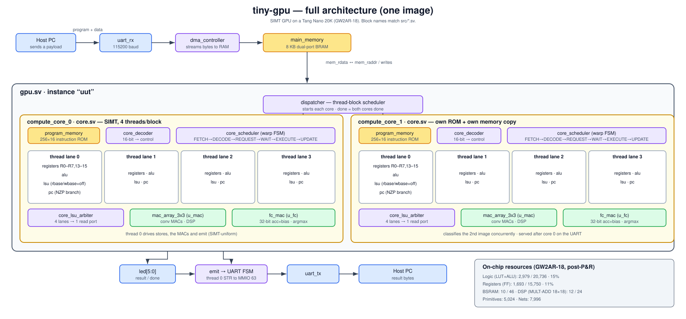
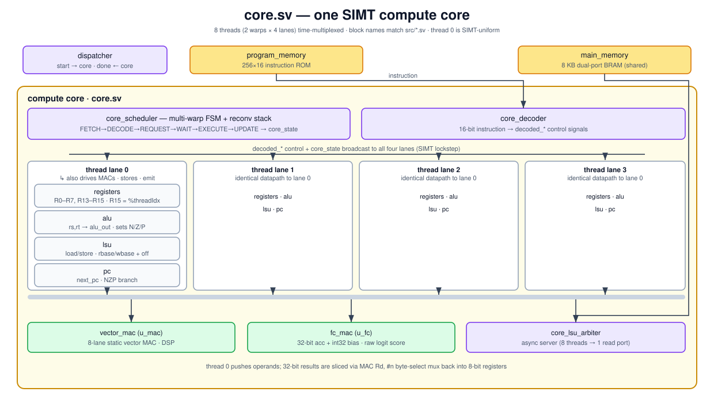

# FPGA GPU

A small SIMT GPU running on a Tang Nano 20K FPGA, programmable in its own language, **J++**.

This project helped me learn how AI models run under the hood.

## What is it

A small SIMT GPU: two compute cores, each with its own warp scheduler, per-lane ALUs, LSU, register files, and a program counter, executing one 16-bit instruction across many threads in lockstep.

- **Runs on real hardware.** The full toolchain — synthesis, place-and-route, timing closure, bitstream flashing — is set up for the Tang Nano 20K.
- **Two independent cores** run in parallel, each with its own program and data memory.
- **Real SIMT features:** multi-warp scheduling for latency hiding, a divergence stack for branch divergence, and programmable thread/block IDs.
- **Host-driven accelerator harness:** a UART receiver feeds a DMA engine that streams program and data into on-chip memory, launches a run, and streams the result back — all with no CPU on the board; the computer acts as the host.
- **Its own programming language:** J++, a small C-like language with a compiler written in Rust, so you can write high-level kernels and stream them into the FPGA without hand-assembling 16-bit opcodes.

## Architecture

[](docs/gpu_overview.svg)

The design has three layers: a host that loads and launches work, the GPU that dispatches it across cores, and the cores that execute it as SIMT threads.

### Top level (`top.sv`)

The board runs as a host-driven accelerator with no CPU of its own. A UART receiver feeds a DMA engine that parses a small header (program size, data size) and streams the kernel and its data into on-chip memory. When the payload is fully loaded, the DMA pulses `gpu_start`; an arming FSM holds the GPU in reset for a few cycles to settle, then releases it for exactly one run. Results the kernel emits are arbitrated back onto the UART transmitter and mirrored to the LEDs. Everything runs on a single clock derived from the 27 MHz crystal by an rPLL (27 × 3 = 81 MHz).

### GPU (`gpu.sv`, `dispatcher.sv`)

The GPU holds two compute cores and a dispatcher. The dispatcher is one-shot: it hands block 0 to core 0 and block 1 to core 1, then waits for both to report done. There is no re-dispatch loop — the number of cores is the number of blocks — which keeps launch control trivial for a fixed-size machine.

Each core has its own copy of the program ROM and its own data memory. The cores run independent program counters, so they can't share a single BRAM read port; duplicating the small ROM is cheaper than arbitrating one. This is what lets the two cores run genuinely in parallel rather than in lockstep with each other.

### Inside a core (`core.sv`, `scheduler.sv`)

[](docs/core_detail.svg)

A core is a single warp scheduler driving shared execution resources:

- **Scheduler** — owns the pipeline state machine and, with multiple warps enabled, picks which warp drives the pipeline each pass. Warps that stall on memory are parked (`WARP_WAITING`) while a ready warp runs, hiding load latency.
- **Fetcher / Decoder** — fetch the 16-bit instruction at the current warp's PC and decode it into control signals (register addresses, immediate, ALU op, memory-op and branch flags).
- **Per-lane datapath** — every thread in a warp has its own ALU, LSU, and register file, so one instruction operates on many threads' data at once (the SIMD/SIMT pattern). The register file includes read-only registers holding this thread's block and thread ID, which is how a single kernel does different work per lane.

### The SIMT pipeline

Each instruction walks a nine-state pipeline:

```
IDLE → SELECT_WARP → FETCH → DECODE → REQUEST → WAIT → EXECUTE → UPDATE → DONE
```

`REQUEST`/`WAIT` exist for memory operations. `SELECT_WARP` is where latency hiding happens: between instructions the scheduler can switch to another warp. `DONE` is terminal.

### Branch divergence

In a SIMT architecture all threads run an instruction in lockstep — but what if you write `if (x > 0)` and only half the threads meet the condition? The hardware is forced to march together, so we handle this with active masking and a hardware divergence stack.

- **The mask (divergence):** when a warp hits a divergent branch, the hardware computes an active mask (e.g. `[1, 1, 0, 0]`). All threads physically execute the instructions inside the `if` block, but the threads that failed the condition (the `0`s) have their register and memory write-enables disabled. They act as "ghosts" — doing the work but leaving no trace.
- **Reconvergence:** when the branch begins, the core pushes a bookmark onto a small internal hardware stack. The bookmark holds the original mask (before the split) and the reconvergence PC (the address where the branch ends). Every instruction, the PC compares the current active mask against the reconvergence point on top of the stack. The moment they match, the `if` block is complete and the mask is restored.

### Memory architecture & arbitration

Data and program memory are physically separate (a strict Harvard architecture), so each core can fetch an instruction and read/write data in the same clock cycle without contention.

- **Sizing:** program memory is 16 bits wide, mapping one assembly opcode per row. Data memory is 8 bits wide; this fork widens the address bus from the original 8-bit (256 bytes) to a 13-bit address space (8 KB).
- **The arbiter:** because this is a SIMT machine, a single `LDR` means multiple threads request memory at the same moment — but the on-chip memory has a single port. The core includes a hardware arbiter that freezes the threads, serializes the requests one by one through the single port across consecutive cycles, then wakes the warp to resume lockstep execution once all data has arrived.

## Instruction Set Architecture (16-bit)

Every instruction is a 16-bit word, decoded as: `[15:12]` opcode · `[11:9]` rd · `[8:6]` rs · `[5:0]` imm (register `rt` in `[2:0]`).

| Opcode | Mnemonic | Meaning / Operation |
| --- | --- | --- |
| `0000` | `FRST`/`FMAC`<br>`FARG`/`FBEST` | **FC-MAC coprocessor** (sub-fn in `[5:4]`): reset / `acc += rs*rt` / finalize digit (add int32 bias, latch logit score) / read logit LSB. |
| `0001` | `ADD rd,rs,rt` | rd = rs + rt |
| `0010` | `MOV rd,#imm` | rd = imm (6-bit immediate) |
| `0010` | `TID`/`BID`<br>`BDIM rd` | `MOV` with `rs`≠0: rd = threadIdx (R15) / blockIdx (R13) / blockDim (R14) |
| `0011` | `CMP rs,rt` | set N/Z/P flags (Negative, Zero, Positive) |
| `0100` | `LDR rd,[rs]` | rd = mem[rbase + rs] (load from memory) |
| `0101` | `ADDI rd,rs,#imm` | rd = rs + imm |
| `0110` | `MACL rs` | push an operand pair into the 8-lane vector MAC buffer |
| `0111` | `MAC rd,#n` | fire the vector MAC → slice byte `#n` (0–3) of the 32-bit sum into rd |
| `1000` | `BRn target` | branch if N (8-bit target, pushes mask to stack on divergence) |
| `1001` | `ADDB #imm` / `WBASE #imm` | advance read base / write base (`[11]` selects) |
| `1010` | `MUL rd,rs,rt` | rd = rs · rt |
| `1011` | `STR rt,[rs]` | mem[wbase + rs] = rt (store to memory; `rs`==63 → UART TX) |
| `1100`/`1101`/`1110` | `SHR`/`SHL`/`SUB` | shift right / shift left / subtract |
| `1111` | `RET` | halt thread |
| `1111` | `SYNC` | pop the reconvergence stack, swap active thread mask (`[0]`=1) |
| _(pseudo)_ | `MAX rd,ra,rb` | assembler-expanded macro (`CMP` + `BRn` + `ADDI`) |

> **Note on registers:** only **R0–R7** are instruction-addressable (3-bit fields). R13–R15 are SIMT identity registers, readable via `TID`/`BID`/`BDIM` (which copy them into an R0–R7 register).

This is a substantial expansion over upstream tiny-gpu's 11 instructions. The additions (MAC/FC coprocessor ops, shift ops, base-pointer registers, `SYNC`) let real dot-product and vector workloads run without exploding the instruction count. Several are encoded to avoid burning opcodes: `WBASE` is `ADDB` with bit 11 set, and `SYNC` is `RET` with bit 0 set — the decoder routes them differently, no new opcode needed.

## Toolchain

Two ways to write kernels — both in `software/` (one Rust crate).

### Assembler

`software/src/main.rs` turns `.asm` into the 16-bit machine words the DMA streams up. It's a direct mnemonic-to-opcode encoder with a few conveniences:

- **Overloaded `ADD`** — a `#`-prefixed third operand auto-selects `ADDI`.
- **Pseudo-ops** that expand to real instructions: `WBASE`, `SYNC`, `MAX`.
- **Labels** for branch targets, resolved to 8-bit addresses.

```bash
cd software
cargo run -- program.asm        # -> program.hex
```

### J++ — a small language

If you'd rather not hand-assemble, **J++** is a C-like language with its own compiler (lexer → parser → codegen, all in `software/src/`). It lowers high-level control flow straight to tiny-gpu assembly:

- `manifest x = …` — declare a variable (register-allocated)
- `grind_until (cond) { … }` — loop, lowered to `CMP` + branch
- `yeet expr` — emit a result byte (the memory-mapped UART store)
- `crunch_push` / `crunch_fire` — drive the MAC coprocessor from source

```bash
cd software
cargo run --bin jpp -- program.jpp program.asm   # J++ -> asm
cargo run -- program.asm                          # asm -> hex
```

So the full path from source to silicon is: **`.jpp` → `.asm` → `.hex` → UART → GPU.**

## Simulation

You don't need the board to run or verify anything — the whole design simulates under Icarus Verilog, and each target is **self-checking** (it asserts the expected result and fails loudly if the hardware is wrong). No cocotb, no Python glue for the core sims — just `iverilog` + `vvp`.

```bash
make sim             # smoke test: kernel computes 5 * 3 = 15
make sim-loadrun     # full path: stream a kernel + data over UART, run, check the reply
make sim-divergence  # per-lane SIMT divergence — lanes take different branches
make sim-divmerge    # divergence + reconvergence — shared code resumes on all lanes
make sim-warps       # two warps run distinct global thread IDs (8 lanes, 0..7)
make sim-mac32       # 32-bit MAC result reads back one byte at a time
make sim-mlp         # parallel FC layer: 9 lanes each write their own neuron
```

These double as the specification: each one is the minimal proof that a specific SIMT feature (divergence, warp IDs, the MAC path) actually works.

## Build & flash

Two synthesis paths, both targeting the Tang Nano 20K (Gowin GW2AR-18).

### Open-source toolchain (recommended)

Yosys + nextpnr-himbaechel + apicula. **This is the validated path** — the vendor's `GowinSynthesis` segfaults on the multi-warp design, so the open-source flow is what actually produces working bitstreams here.

```bash
export OSS_CAD_SUITE=/path/to/oss-cad-suite   # from YosysHQ/oss-cad-suite-build
make build-oss        # -> oss_build/tiny_gpu_oss.fs
make flash-oss        # load into SRAM (volatile)
```

For the largest AI-capable configuration (2 cores × 1 warp × 9 lanes = 18 ALU lanes, ~78% LUT, 140 MHz):

```bash
make build-oss-max    # -> oss_build/tiny_gpu_max18.fs
make flash-oss-max
```

### Vendor toolchain

The Gowin flow is still wired up (`build_fpga.sh` / `flash.sh`) for single-warp configs:

```bash
make build            # -> impl/pnr/tiny_gpu.fs
make flash            # SRAM (volatile)
make flash-persist    # write to SPI flash (survives power-cycle)
```

`flash` loads into SRAM and is gone on power-cycle — good for iterating. `flash-persist` burns the external SPI flash so the design boots on its own.

### End to end

Once a bitstream is on the board, the whole `.jpp → asm → hex → UART → GPU → result` pipeline is one command:

```bash
make run-jpp JPP=software/your_kernel.jpp READ=8
```

That compiles your J++ source, assembles it, streams it to the FPGA, runs it, and prints the bytes the kernel emits back.

### Prerequisites

- **Rust** (`cargo`) — assembler + J++ compiler
- **Icarus Verilog** (`iverilog`, `vvp`) — simulation
- **oss-cad-suite** (Yosys, nextpnr-himbaechel, apicula, openFPGALoader) — synthesis + flashing
- **Python 3** — the UART host scripts (`send_kernel.py`)

## Synthesis & utilization (Tang Nano 20K · GW2AR-18C)

From `impl/pnr/tiny_gpu.rpt.html`:

| Resource        | Used                            | Available | Util. |
| --------------- | ------------------------------- | --------- | ----- |
| Logic (LUT+ALU) | 1501 (1052 LUT4, 449 ALU)       | 20736     | 8 %   |
| Registers       | 878 (877 FF + 1 I/O)            | 15750     | 6 %   |
| CLS (slices)    | 1180                            | 10368     | 12 %  |
| Block SRAM      | 4 SDPB + 1 pROM                 | 46        | 11 %  |
| DSP             | 4× MULT9X9 + 5× MULTADDALU18X18 | —         | 25 %  |
| I/O ports       | 9                               | 66        | 14 %  |
| PLL             | 0                               | 2         | 0 %   |

Clocked at **81 MHz** (rPLL, 27 × 3). The 18-lane max configuration closes timing around 140 MHz.

## Repo layout

```
src/        gpu, core, scheduler, dispatcher, decoder, registers, alu, pc, lsu,
            lsu_arbiter, lsu_write_arbiter, vector_mac (8-lane vector MAC),
            fc_mac (FC + argmax), main_memory, program_memory, dma_controller,
            data_pipeline, uart_rx/tx, gowin_pll, top
software/   Rust crate: assembler (src/main.rs) + J++ compiler (src/bin/jpp.rs);
            example kernels (*.asm, *.jpp); Python UART host scripts (send_kernel.py)
test/       tb*.sv — self-checking testbenches (loadrun, divergence, warps, MAC, MLP)
oss_build/  open-source synthesis flow (run_oss.sh, build_cfg.sh)
*.sh, *.tcl headless Gowin build/flash on macOS
```

## Credits

Forked from [tiny-gpu](https://github.com/adam-maj/tiny-gpu) by Adam Majmudar — a simulation-only teaching GPU. This fork takes that core onto real silicon and grows the ISA, toolchain, and SIMT feature set from there.
