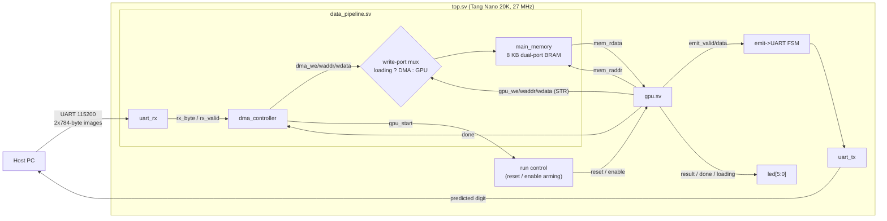
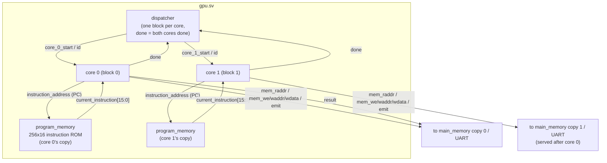
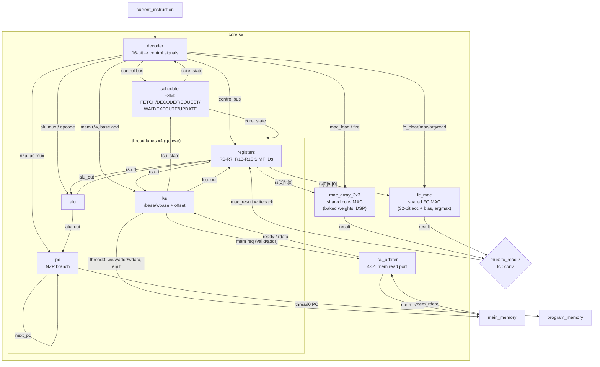

# tiny-gpu architecture

Block diagrams generated from the RTL (`src/`). Three zoom levels: the board-level
system, the GPU, and one compute core with its SIMT thread lanes.

## System level (`top.sv` + `data_pipeline.sv`)

## GPU level (`gpu.sv`)

Each core owns a private copy of the kernel ROM and of `main_memory` (the
core↔memory read path has no handshake, so the BRAM ports can't be time-shared).
The host streams **two 784-byte images per run**; the DMA writes the first into
core 0's memory copy and the second into core 1's, and the cores classify them
concurrently. The dispatcher is one-shot per run (a core's DONE state is
terminal until the per-run GPU reset), so `TOTAL_BLOCKS` must be ≤ 2 and `done`
is the AND of both cores' sticky done levels.

**Emit protocol** (gpu-level FSM): the single UART serves core 0's bytes first —
core 1's LSU just stalls on the emit handshake until core 0 is terminally done —
and a 24-bit cycle counter (start→done, MSB-first) is hardware-appended after
each core's bytes. Per run the host receives 8 bytes:
`[digit0][cycles0 ×3][digit1][cycles1 ×3]`. Core 1's count includes its wait
for core 0's UART bytes (~9.4k cycles for 4 bytes at 115200).

## Core level (`core.sv`) — SIMT, 4 threads/block

Notes:
- Only **thread 0** drives stores, the conv/FC MACs, and emit (SIMT-uniform model);
  reads from all 4 lanes are serialized by `lsu_arbiter`.
- The two MAC coprocessors are **core-level shared** units, not per-lane — same split
  of labor as tensor cores beside scalar lanes on a real GPU.
- Both cores are fully wired (own ROM copy + own data-memory copy); only core 0
  reaches the UART/LEDs.
